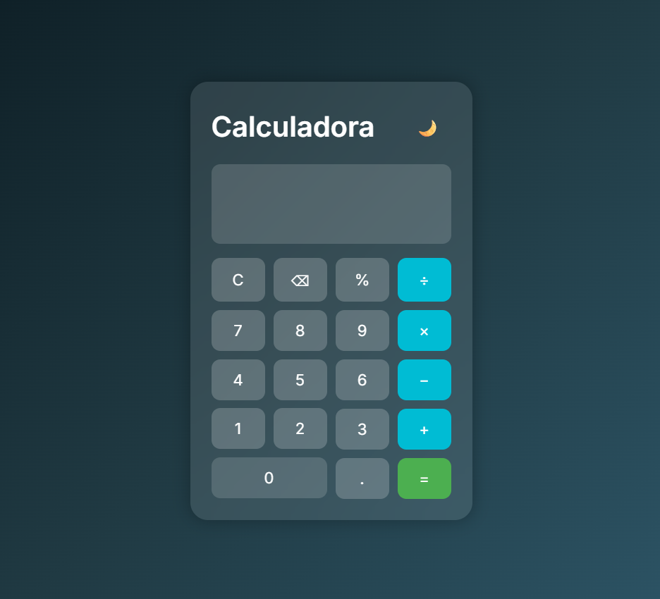
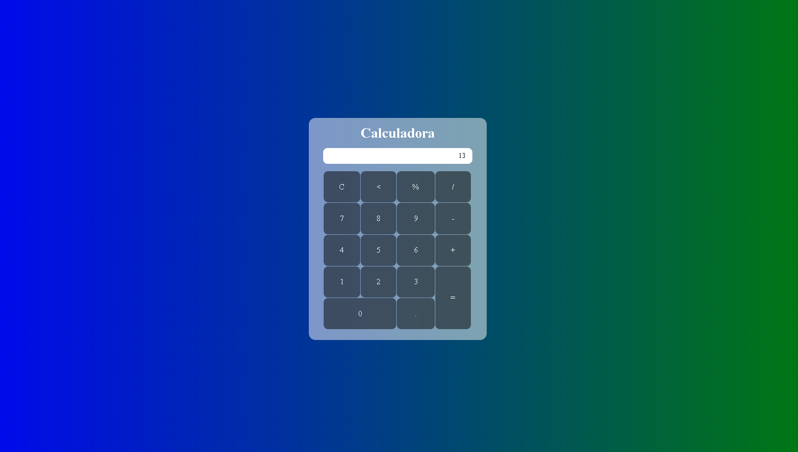

<!--
title: "Calculator JS"
description: "Uma calculadora moderna e minimalista em JavaScript"
author: "Eduardo Esteves"
tags: ["javascript", "calculadora", "frontend", "web"]
date: 2025-10-05
version: "2.0"
license: "MIT"
-->

# 🧮 Calculator JS

Uma **calculadora moderna e minimalista** desenvolvida em **HTML, CSS e JavaScript puro**.  
O projeto foi criado com foco em **simplicidade, responsividade e design premium**, oferecendo uma experiência fluida tanto no modo escuro quanto no modo claro.

---

## ✨ Funcionalidades

- 🌗 **Modo Dark/Light** — alterne o tema com um clique.  
- 🧠 **Memória da última operação** — exibe o histórico do cálculo anterior.  
- ⚡ **Atualização em tempo real** — resultado exibido automaticamente.  
- 💎 **Design minimalista e refinado** — interface moderna e responsiva.  
- ⌨️ **Suporte ao teclado** — use números e operadores direto do teclado.  

---

## 🖼️ Visual do Projeto

### Novo Design  


### Design Antigo  


---

## 🛠️ Tecnologias Utilizadas

- **HTML5** → estrutura do projeto  
- **CSS3** → estilo visual, efeitos e tema dark/light  
- **JavaScript (ES6)** → lógica dos cálculos e interações  

---

## 🚀 Como Executar o Projeto

1. Clone este repositório:
   ```bash
   git clone https://github.com/seuusuario/calculator-js.git
